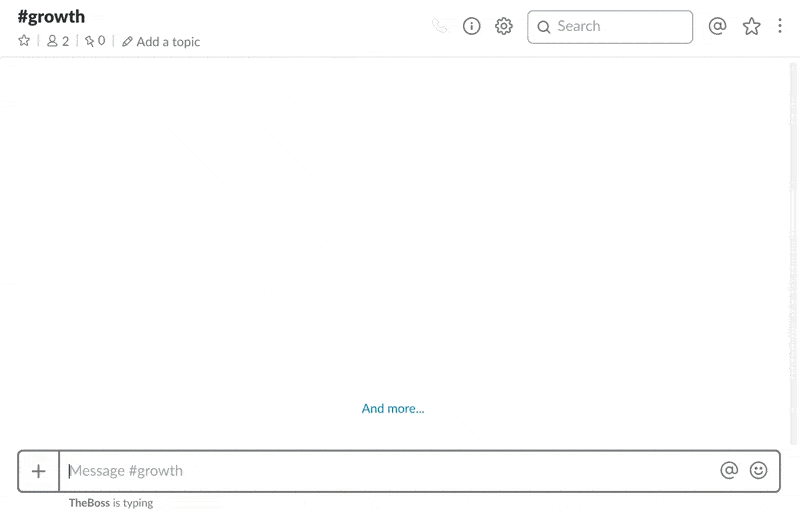

# vizbee agent



## Installation

```bash
python -m pip install vizbee
```

optionally the target(s) data source an be passed as argument to install
required dependencies:

```bash
python -m pip install vizbee[<source>]
```

where `<source>` is one of:

* postgresql
* oracle
* mysql
* redshift
* sqlserver
* sybase

## Usage

```bash
Usage: vizbee [OPTIONS] COMMAND [ARGS]...

Options:
  -c, --config TEXT     The YAML configuration file path.
  --client-id TEXT      The application id.
  --client-secret TEXT  The application secret.
  --api-url TEXT        The api url.
  --help                Show this message and exit.

Commands:
  dashboard  Manage dashboards.
  dataset    Manage datasets.
  start      Start scheduler.
  sync       Push all datasets and dashboards.
```

## Connections

This section defines the connections to the data stores
(the ``default`` field sets the default one).

```yaml
connections:
    default: {DATABASE_URL}
```

Currently supported database are:

* PostgreSQL: `postgresql://<user>:<password>@<host>/<db>`
* MySQL: `mysql://<user>:<password>@<host>/<db>`
* Oracle: `oracle://<user>:<password>@<host>/<db>`
* Redshift: `redshift://<user>:<password>@<host>/<db>`
* SQLServer: `mssql://<user>:<password>@<host>/<db>`

## Datasets

A `Dataset` represents a single set of data:

```yaml
datasets:
    my-dataset:
        name: <The dataset name>

        connection: <The connection to use>

        query: <The query used to fetched data>

        graph: <The graph options>

        schedule: <The scheduling rule>
```

See [dataset schema](https://vizbee.io/documentation/schema#dataset) for more details.

## Dashboards

A `Dashboard` represents a `Dataset` collection:

```yaml
dashboards:
    my-dashboard:
        name: <The dashboard name>

        datasets:
            - <The datasets to include>
```

See [dashboard schema](https://visbee.io/documentation/schema#dashboard) for more details.

## Scheduling

The agent can be started as a daemon to schedule datasets update,
it require to define a scheduling rule such as:

```yaml
schedule: 5 minutes
```

and the start the deamon:

```bash
vizbee start
```

For each `Dataset` the scheduling rule can be overriden by adding a
`schedule: <rule>` in its schema.

The scheduling rule format is: `<count> <seconds|minutes|hours|days>`
